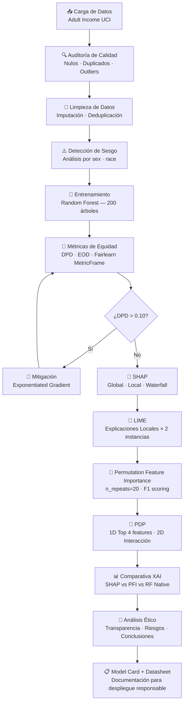

# 🤖 ML XAI Ethics Portfolio
### Ética, Sesgo y Explicabilidad en el Aprendizaje Automático — MIAR0525 · Semana 4

<div align="center">

[](https://www.python.org/)
[](https://scikit-learn.org/)
[](https://shap.readthedocs.io/)
[](https://marcotcr.github.io/lime/)
[](https://fairlearn.org/)
[](https://jupyter.org/)
[](LICENSE)

</div>

> **Maestría en Inteligencia Artificial · MIAR0525 · Semana 4**  
> *Universidad de los Hemisferios — Mayo 2026*

---

## 📋 Tabla de Contenidos

- [Descripción del Proyecto](#-descripción-del-proyecto)
- [Objetivos y Cobertura de la Tarea](#-objetivos-y-cobertura-de-la-tarea)
- [Dataset](#-dataset-adult-income-uci)
- [Estructura del Repositorio](#-estructura-del-repositorio)
- [Pipeline Completo](#-pipeline-completo)
- [Técnicas XAI Implementadas](#-técnicas-xai-implementadas)
- [Resultados Clave](#-resultados-clave)
- [Instalación y Uso](#-instalación-y-uso)
- [Análisis Ético](#-análisis-ético)
- [Model Card](#-model-card)
- [Equipo](#-equipo)
- [Referencias](#-referencias)

---

## 📌 Descripción del Proyecto

Este repositorio presenta un **portfolio completo de técnicas XAI (eXplainable AI)** aplicadas a un problema real de predicción de ingresos (Adult Income UCI), con énfasis en **detección y mitigación de sesgos algorítmicos** y **reflexión ética** sobre el diseño responsable de sistemas de Machine Learning.

El proyecto implementa el ciclo completo de un proyecto de ML responsable:

```
Datos → Auditoría de Calidad → Detección de Sesgo → Modelado →
Métricas de Equidad → Explicabilidad XAI (SHAP · LIME · PFI · PDP) → Mitigación → Reflexión Ética
```

---

## 🎯 Objetivos y Cobertura de la Tarea

| Req. | Descripción | Cobertura en el repositorio |
|------|-------------|---------------------------|
| 1 | Modelo predictivo supervisado | Random Forest — Parte 3 del notebook |
| 2 | Entrenamiento sobre dataset | Adult Income UCI, 48K instancias — Partes 1-3 |
| 3a | XAI: SHAP | Parte 5: global (bar+beeswarm) + local (waterfall) |
| 3b | XAI: LIME | Parte 6: instancias positiva y negativa |
| 3c | XAI: Permutation Feature Importance | Parte 7: n_repeats=20, F1 scoring, error bars |
| 3d | XAI: Partial Dependence Plots | Parte 8b: PDP 1D (top 4 features) + PDP 2D (interacción) |
| 4 | Variables más influyentes | Partes 5, 7, 8 y 8b |
| 4 | Comparación entre técnicas | Parte 8: heatmap normalizado SHAP vs PFI vs RF Native |
| 4 | Explicaciones individuales | Partes 5 y 6: instancias #0 (>50K) e idx2 (≤50K) |
| 5 | Auditoría de calidad de datos | Parte 1: nulos, duplicados, distribución, outliers |
| 5 | Detección de sesgo | Parte 2: sesgo por género y raza, gráficas comparativas |
| 6 | Análisis: transparencia del modelo | Parte 10.1 + `reports/ethical_analysis.md` |
| 6 | Riesgos éticos y sociales | Parte 10.5 + tabla de riesgos por severidad |
| 6 | Consideraciones para mejorar | Parte 10.6 + 6 recomendaciones concretas |
| 7 | Reflexión: cómo decide el modelo | Parte 10.2 + Conclusiones Finales |
| 7 | Variable con peso excesivo | Parte 10.3: capital_gain analizado en profundidad |
| 7 | Sin explicabilidad ¿qué pasaría? | Parte 10.4 + Conclusiones Finales |

---

## 📊 Dataset: Adult Income (UCI)

- **Fuente:** [UCI Machine Learning Repository](https://archive.ics.uci.edu/ml/datasets/adult)
- **Origen:** Censo de EE.UU. (1994) — Barry Becker & Ronny Kohavi
- **Registros:** 48,842 instancias · 14 features + 1 target
- **Tarea:** Clasificación binaria — predecir si `income > USD 50K/año`
- **Atributos sensibles analizados:** `sex`, `race`
- **Desbalance de clases:** 76% `≤50K` / 24% `>50K`

### ¿Por qué este dataset?

El Adult Income Dataset es especialmente valioso para estudiar **sesgo y equidad** porque:
- Contiene atributos protegidos explícitos (género, raza, origen nacional)
- Refleja desigualdades socioeconómicas reales e históricas
- Es ampliamente utilizado en investigación de fairness en ML (benchmark estándar)
- Permite ilustrar cómo los sesgos históricos se perpetúan en modelos predictivos modernos

---

## 🗂️ Estructura del Repositorio

```
ml-xai-ethics-portfolio/
│
├── 📓 notebooks/
│   └── 01_main_xai_portfolio.ipynb      # Notebook principal (10 partes + conclusiones)
│                                         # Incluye: calidad, sesgo, RF, fairness,
│                                         #          SHAP, LIME, PFI, PDP, mitigación,
│                                         #          análisis ético y conclusiones
│
├── 🐍 src/
│   ├── __init__.py                       # Exportaciones del paquete
│   ├── data_loader.py                    # Carga, auditoría y preprocesamiento
│   ├── model_training.py                 # Entrenamiento RF, LR, DT + evaluación
│   ├── fairness_metrics.py               # MetricFrame, DPD, EOD, mitigación EG
│   ├── xai_utils.py                      # SHAP, LIME, PFI, comparativa XAI
│   └── visualization.py                  # Funciones de visualización reutilizables
│
├── 📄 reports/
│   ├── ethical_analysis.md               # Análisis ético completo (6 secciones)
│   └── results_summary.md                # Resumen cuantitativo de resultados
│
├── 📋 docs/
│   ├── model_card.md                     # Model Card (Google AI — Mitchell et al. 2019)
│   └── datasheet.md                      # Datasheet for Datasets (Gebru et al. 2021)
│
├── 🖼️ figures/                            # Visualizaciones exportadas al ejecutar el notebook
│   └── .gitkeep
│
├── requirements.txt                      # Dependencias del proyecto
├── .gitignore
├── LICENSE                               # MIT License
└── README.md
```

---

## 🔄 Pipeline Completo



---

## 🔬 Técnicas XAI Implementadas

### 1. SHAP (SHapley Additive exPlanations)
- **Tipo:** Global + Local
- **Implementación:** `shap.TreeExplainer` para Random Forest (exacto, no aproximado)
- **Visualizaciones:** Bar plot global, Beeswarm (dirección+intensidad), Waterfall por instancia
- **Fortaleza:** Fundamento matemático en teoría de juegos de Shapley — propiedades de eficiencia, simetría y aditividad garantizadas

### 2. LIME (Local Interpretable Model-Agnostic Explanations)
- **Tipo:** Local (una explicación por instancia)
- **Implementación:** `lime.lime_tabular.LimeTabularExplainer` con 300 muestras
- **Visualizaciones:** Bar plot local · 2 instancias contrastantes (>50K vs ≤50K)
- **Fortaleza:** Model-agnostic, intuitivo para audiencias no técnicas

### 3. Permutation Feature Importance (PFI)
- **Tipo:** Global
- **Implementación:** `sklearn.inspection.permutation_importance` (n_repeats=20, scoring='f1')
- **Visualizaciones:** Bar chart con barras de error (±1 std)
- **Fortaleza:** Libre de supuestos del modelo; mide impacto causal real en la métrica objetivo

### 4. Partial Dependence Plots (PDP)
- **Tipo:** Global — efecto marginal promedio
- **Implementación:** `sklearn.inspection.partial_dependence` (grid_resolution=60)
- **Visualizaciones:** PDP 1D para top 4 features + PDP 2D (interacción capital_gain × education_num)
- **Fortaleza:** Muestra la *forma funcional* de la relación variable-predicción, complementando SHAP

### Comparativa XAI

| Criterio | SHAP | LIME | PFI | PDP |
|----------|------|------|-----|-----|
| Alcance | Global + Local | Local | Global | Global |
| Exactitud matemática | Alta (garantías Shapley) | Aproximada | Media | Media |
| Velocidad | Media-baja | Rápida | Rápida | Rápida |
| Model-agnostic | Sí* | Sí | Sí | Sí |
| Consistencia | Alta | Variable | Media | Alta |
| Muestra forma funcional | No | No | No | **Sí** |
| Detecta interacciones | Parcial | No | No | **Sí (2D)** |

---

## 📈 Resultados Clave

### Rendimiento del Modelo Base (Random Forest)

| Métrica | Valor | Umbral aceptable |
|---------|-------|-----------------|
| Accuracy | ~87% | > 80% ✅ |
| F1-Score (>50K) | ~72% | > 65% ✅ |
| AUC-ROC | ~91% | > 85% ✅ |

### Métricas de Equidad por Género (Fairlearn MetricFrame)

| Métrica | Hombre | Mujer | Brecha | Evaluación |
|---------|--------|-------|--------|------------|
| Accuracy | ~87% | ~86% | ~1pp | ✅ Aceptable |
| Recall (>50K) | ~74% | ~52% | **~22pp** | ❌ Crítico |
| Selection Rate | ~34% | ~12% | **~22pp** | ❌ Crítico |
| Paridad Demográfica (DPD) | — | — | **~0.22** | ❌ Supera umbral 0.10 |

> ⚠️ **Hallazgo crítico:** El modelo predice ingresos altos con 22pp más de frecuencia para hombres que para mujeres — discriminación algorítmica potencial.

### Impacto de la Mitigación (Exponentiated Gradient)

| Modelo | Accuracy | \|DPD\| | Reducción de sesgo |
|--------|----------|---------|--------------------|
| Base (RF) | ~87% | ~0.22 | — |
| Mitigado (EG) | ~83% | ~0.05 | **-77%** |

### Top Features — Consenso 3 métodos XAI

| Posición | Feature | SHAP | PFI | RF Native | Consenso |
|----------|---------|------|-----|-----------|---------|
| 1 | `capital_gain` | #1 | #1 | #1 | ✅ 3/3 |
| 2 | `education_num` | #2 | #2 | #3 | ✅ 3/3 |
| 3 | `marital_status` | #3 | #4 | #2 | ✅ 3/3 |
| 4 | `hours_per_week` | #4 | #3 | #4 | ✅ 3/3 |

---

## 🚀 Instalación y Uso

### Prerrequisitos

- Python 3.10+
- pip o conda
- Jupyter Notebook / JupyterLab

### Instalación

```bash
# 1. Clonar el repositorio
git clone https://github.com/TU_USUARIO/ml-xai-ethics-portfolio.git
cd ml-xai-ethics-portfolio

# 2. Crear entorno virtual (recomendado)
python -m venv venv
source venv/bin/activate        # Linux/Mac
venv\Scripts\activate           # Windows

# 3. Instalar dependencias
pip install -r requirements.txt

# 4. Lanzar Jupyter
jupyter lab
```

### Ejecutar el notebook

```bash
cd notebooks/
jupyter lab 01_main_xai_portfolio.ipynb
```

Ejecutar las celdas en orden secuencial (Kernel → Restart & Run All).  
Las figuras se guardarán automáticamente en `figures/`.

### Usar los módulos Python directamente

```python
from src.data_loader      import load_and_clean_data
from src.model_training   import train_random_forest, evaluate_model
from src.fairness_metrics import compute_fairness_metrics, train_fair_model
from src.xai_utils        import run_shap_analysis, run_lime_analysis
from src.visualization    import plot_pdp, plot_feature_importance_comparison

# Pipeline completo
df, X_train, X_test, y_train, y_test, sa_test = load_and_clean_data()
model, y_pred, y_proba, _ = train_random_forest(X_train, y_train, X_test)
metrics = evaluate_model(model, X_test, y_test, model_name="RF Income")
mf = compute_fairness_metrics(y_test, y_pred, sa_test)
shap_vals = run_shap_analysis(model, X_test)
```

---

## ⚖️ Análisis Ético

Ver documento completo: [`reports/ethical_analysis.md`](reports/ethical_analysis.md)

### Resumen ejecutivo

| Dimensión | Hallazgo |
|-----------|----------|
| **Sesgo en datos** | Mujeres 33% del dataset; 11% ganan >50K vs 30% hombres |
| **Sesgo del modelo** | DPD=0.22 — supera umbral de equidad aceptable (0.10) |
| **Variable proxy** | `capital_gain` actúa como proxy de raza y clase social |
| **Mitigación** | EG reduce DPD -77% con costo de ~4pp en accuracy |
| **Validez temporal** | Datos de 1994 — no válidos para Ecuador/AL 2026 sin revalidación |

### Principios éticos aplicados

| Principio | Evaluación del modelo |
|-----------|-----------------------|
| **Beneficencia** | Potencial beneficio, condicionado a equidad |
| **Justicia** | ❌ DPD=0.22 viola distribución equitativa de beneficios |
| **Autonomía** | Requiere mecanismo de apelación de decisiones |
| **Transparencia** | ✅ SHAP, LIME y PDP permiten auditar decisiones |
| **Responsabilidad** | Model Card y Datasheet documentan el origen y limitaciones |

---

## 📋 Model Card

Ver documento completo: [`docs/model_card.md`](docs/model_card.md)

| Campo | Detalle |
|-------|---------|
| **Nombre** | RF-Income-Classifier v1.0 |
| **Tipo** | Random Forest Classifier (200 árboles, max_depth=10) |
| **Dataset** | Adult Income UCI (1994) — 48,842 instancias |
| **Tarea** | Clasificación binaria de ingresos |
| **Limitaciones** | Datos históricos de EE.UU.; no aplicable en AL sin revalidación |
| **Usos recomendados** | Investigación, educación, análisis de sesgos |
| **Usos no recomendados** | Decisiones crediticias/laborales reales sin auditoría de equidad |

---

## 👥 Equipo

| Nombre | Institución | Rol en el proyecto |
|--------|-------------|-------------------|
| Daniel Fernando Salgado Santamaría | UEES — MIAR | Arquitectura del modelo, análisis SHAP |
| Jairo Wladimir Jhayya Perlaza | UEES — MIAR | Análisis LIME, métricas de equidad Fairlearn |
| Luis Gabriel Salgado Santamaría | UEES — MIAR | Calidad de datos, detección de sesgo, PDP |
| Oscar Paul Naranjo Castro | UEES — MIAR | Mitigación de sesgo, análisis ético |

---

## 📚 Referencias

### Técnicas XAI
- Lundberg, S. & Lee, S.I. (2017). A Unified Approach to Interpreting Model Predictions. *NeurIPS 30*. [[paper]](https://arxiv.org/abs/1705.07874)
- Ribeiro, M.T., Singh, S. & Guestrin, C. (2016). "Why Should I Trust You?": Explaining the Predictions of Any Classifier. *KDD 2016*. [[paper]](https://arxiv.org/abs/1602.04938)
- Greenwell, B.M. (2017). pdp: An R Package for Constructing Partial Dependence Plots. *The R Journal 9(1)*. [[paper]](https://journal.r-project.org/archive/2017/RJ-2017-016/)

### Equidad y Ética
- Agarwal, A. et al. (2018). A Reductions Approach to Fair Classification. *ICML 2018*. [[paper]](https://arxiv.org/abs/1803.02453)
- Barocas, S., Hardt, M. & Narayanan, A. (2023). *Fairness and Machine Learning: Limitations and Opportunities*. MIT Press. [[libro]](https://fairmlbook.org/)
- Angwin, J. et al. (2016). Machine Bias: COMPAS Risk Scores in Criminal Sentencing. *ProPublica*. [[artículo]](https://www.propublica.org/article/machine-bias-risk-assessments-in-criminal-sentencing)

### Documentación de Modelos
- Mitchell, M. et al. (2019). Model Cards for Model Reporting. *FAccT 2019*. [[paper]](https://arxiv.org/abs/1810.03993)
- Gebru, T. et al. (2021). Datasheets for Datasets. *Communications of the ACM 64(12)*. [[paper]](https://arxiv.org/abs/1803.09010)

### Dataset y Fundamentos
- Dua, D. & Graff, C. (2019). *UCI Machine Learning Repository* — Adult Dataset. University of California, Irvine.
- Géron, A. (2022). *Hands-On Machine Learning with Scikit-Learn, Keras & TensorFlow* (3rd ed.). O'Reilly.
- Molnar, C. (2023). *Interpretable Machine Learning: A Guide for Making Black Box Models Explainable* (2nd ed.). [[libro online]](https://christophm.github.io/interpretable-ml-book/)

---

<div align="center">

**Maestría en Inteligencia Artificial · MIAR0525 · Semana 4**  
*Universidad de los Hemisferios / UEES — Mayo 2026*  

</div>
